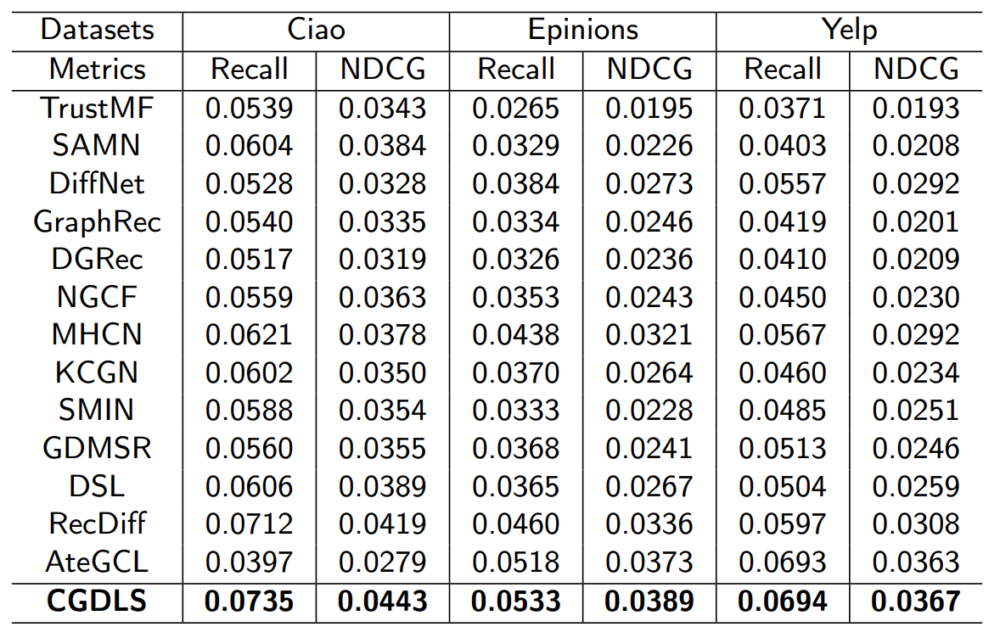

# CGDLS
This is the PyTorch-based implementation for CGDLS model proposed in this paper:

## Code Structures 
    .
    ├── DataHandler.py
    ├── main.py
    ├── param.py
    ├── utils.py
    ├── Utils                    
    │   ├── TimeLogger.py            
    │   ├── Utils.py                             
    ├── models
    │   ├── diffusion_process.py
    │   ├── model.py
    ├── scripts
    │   ├── run_ciao.bat
    │   ├── run_ciao.sh
    │   ├── run_epinions.bat
    │   ├── run_epinions.sh
    │   ├── run_yelp.bat
    │   ├── run_yelp.sh
    └── README

## Environment
- python=3.8
- torch=1.12.1
- numpy=1.23.1
- scipy=1.9.1
- dgl=1.1.1+cu113
- scikit-learn=1.3.2
## Datasets
Our experiments are conducted on three benchmark datasets collected from Ciao, Epinions and Yelp online platforms. In those sites, social connections can be established among users in addition to their observed implicit feedback (e.g., rating, click) over different items.

| Dataset  | # Users | # Items | # Interactions | # Social Ties |
| :------: | :-----: |:-------:|:--------------:|:-------------:|
|   Ciao   |  1,925  | 1,5053  |     23,223     |    65,084     |
| Epinions | 14,680  | 233,261 |    447,312     |    632,144    |
|   Yelp   |  99,262 | 105,142 |    672,513     |   1,298,522   |
## Usage

Please unzip the datasets first. Also you need to create the `History/`+'dataset_name (e.g,ciao)' and the `Models/`+ 'dataset_name (e.g,ciao)' directories. The command lines to train SDR on the three datasets are as below. The hyperparameters in the commands are set as default.

- Ciao
- for Windows
  ```
  scripts/run_ciao.bat
  ```  
- for Linux
  ```shell
  bash scripts/run_ciao.sh
  ```

- Epinions
- for Windows
  ```
  scripts/run_epinions.bat
  ```  
- for Linux
  ```shell
  bash scripts/run_epinions.sh
  ```

- Yelp
- for Windows
  ```
  scripts/run_yelp.bat
  ```  

- for Linux
  ```shell
  bash scripts/run_yelp.sh
  ```
## Evaluation Results
### Overall Performance:
CGDLS outperforms the baseline model with top-20 settings.


